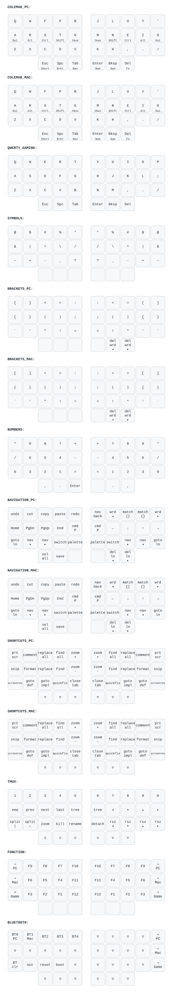
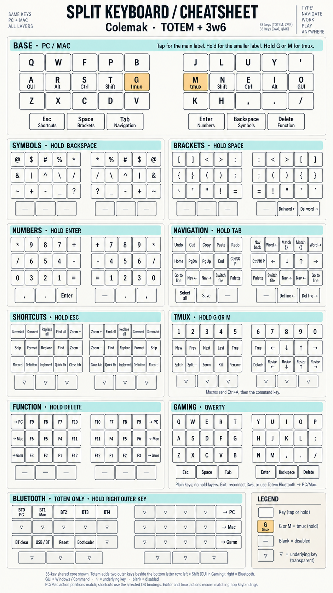

# keyboards

One layout, two boards. A single generator produces the keymaps for both my
split keyboards from **one shared layout definition**:

| Board | Firmware | Keys | Generated file |
|-------|----------|------|----------------|
| [Totem](totem/) | ZMK  | 38 (2 extra outer pinky keys, wireless) | `totem/config/totem.keymap` |
| [3w6](3w6/)     | QMK  | 36 (wired, per-key RGB)                 | `3w6/3w6_rgb/keymaps/default/keymap.c` |

## How it works

The layout ("what key goes where") is defined **once**; only the *definition
part* ("what each macro name expands to") is swapped per board.

```
generate.py            # dispatcher: python generate.py totem|3w6|draw|all
layout/
  layers.py            # the shared 14x4 canonical grids, one per layer
  names.py             # canonical token -> (ZMK expansion, QMK expansion)
  engine.py            # grid walk (outer_keys flag) + per-target formatting
  draw.py              # canonical token -> display legend (keymap-drawer YAML)
targets/
  zmk.py               # ZMK boilerplate: behaviors, macros{} node, keymap wrapper
  qmk.py               # QMK boilerplate: enums, tmux table, RGB/OS-detection code
totem/ , 3w6/          # self-contained, buildable board configs
keymap-drawer/         # generated keymap.yaml (visualization definition)
check_equivalence.py   # optional migration check (needs the pre-merge generators)
.github/workflows/    # QMK + ZMK builds and generated-layout checks
```

Every grid cell is a **canonical token** (`K_Q`, `HM_A`, `LT_SYM`, `SY_AT`,
`TM_W1`, …). Each board's `targets/` module maps those names to its own syntax —
e.g. the home-row `A` is `HM_A`, which becomes `&mt LGUI A` on ZMK and
`LGUI_T(KC_A)` on QMK. The generated keymaps therefore use identical names in the
layout section and differ only in the `#define`/definition header.

### The one physical difference

The Totem has two extra outer-pinky keys (cols 0 and 13 of the 14-wide grid) and a
Bluetooth layer; the 3w6 does not. This is the single knob `outer_keys`:
`targets/zmk.py` sets it `True` (38 keys), `targets/qmk.py` sets it `False`
(cols 0/13 dropped → 36 keys). The grids themselves are the same for both.

## Regenerate

```sh
python generate.py all          # regenerate both keymaps + the drawer YAML
```

Local build scripts regenerate their board's keymap before compiling. After a
layout edit, run `python generate.py all` to also update the other board and the
drawer YAML before committing. CI rejects missing or stale generated files:

```sh
python generate.py all --check   # read-only freshness check
python -m unittest discover -s tests
```

`check_equivalence.py` optionally compares against the pre-merge generators. It
accepts the intentional change from holding **B/J** to holding **G/M** for tmux
on both Colemak layers, keeping the holds on the home row; all other binding
differences fail. It needs the original generators (see its file header) and is
not needed for generation, tests, or firmware builds.

## Visualize the layers

`generate.py draw` writes a [keymap-drawer](https://github.com/caksoylar/keymap-drawer)
definition to `keymap-drawer/keymap.yaml` (the shared split 3x5+3 core, all layers,
with tap/hold legends). Render it to SVG:

```sh
pipx install keymap-drawer          # or: pip install keymap-drawer
keymap draw keymap-drawer/keymap.yaml > keymap-drawer/keymap.svg
```

The current render ([`keymap-drawer/keymap.svg`](keymap-drawer/keymap.svg)):



The Totem's two extra outer keys sit beside the **bottom letter row**: Shift on
the left (GUI in Gaming), hold-for-Bluetooth on the right. They aren't in the
ortho drawing — noted at the top of the YAML.

### Printable cheatsheet

[`keymap-drawer/cheatsheet.png`](keymap-drawer/cheatsheet.png) is an imagegen-created
reference for the shared layout, with PC/Mac action panels combined and the
Totem Bluetooth layer included. The exact generation prompt is saved in
[`cheatsheet-prompt.txt`](keymap-drawer/cheatsheet-prompt.txt), with its targeted
correction in [`cheatsheet-edit-prompt.txt`](keymap-drawer/cheatsheet-edit-prompt.txt).
This image is a snapshot; regenerate it after layout changes. The generated
YAML/SVG remains the per-layer reference.



## Build

```sh
cd totem && bash scripts/build-local.sh      # ZMK  (Docker)
cd 3w6   && ./build.sh                        # QMK  (Docker)
```

The local scripts need Python 3 and Docker (Totem also supports Podman), and can
also be invoked by path from the repository root. On Windows, use
`3w6/build.ps1` with Python and Docker available. Artifacts go to
`totem/firmware/` and `3w6/firmware/`.

GitHub Actions workflows live at the repository root:

* [Build QMK firmware](.github/workflows/build-qmk.yml) builds 3w6 and uploads
  `3w6-firmware` containing `3w6_rgb_default.uf2`.
* [Build ZMK firmware](.github/workflows/build-zmk.yml) uses the local build script
  with `totem/build.yaml` and `totem/config`, builds both halves in an isolated
  workspace, and uploads `totem-firmware` containing
  `totem_left-xiao_ble-zmk.uf2` and `totem_right-xiao_ble-zmk.uf2`.

Both run on pushes, pull requests, and manual dispatch, and check generated files
and layout tests before compilation. Firmware builds use upstream QMK and ZMK;
the retired configuration repositories are not required. Upstream revisions and
container tags currently track their moving defaults, so builds are not pinned.

### Switching base layouts

From Colemak, hold Delete for the Function layer, then choose PC, Mac, or Game.
The 3w6 also selects PC/Mac automatically on host detection. Gaming uses plain
keys without layer holds: on 3w6, reconnect the keyboard to return to the detected
PC/Mac base; on Totem, hold the right outer Bluetooth key and choose PC or Mac.

## Editing the layout

* **Move/assign a key:** edit the grid in [`layout/layers.py`](layout/layers.py).
  Changes apply to both boards automatically.
* **Add a new key/behavior:** add a canonical token to
  [`layout/names.py`](layout/names.py) with its ZMK and QMK expansion, then use it
  in a grid. Multi-key/tmux/Bluetooth behaviors also need their node (ZMK) or
  custom keycode (QMK) in the relevant `targets/` module.
* **tmux macros** must stay aligned with `~/.tmux/keybindings.conf`.

## Based on

This repo unifies the keymaps for two existing keyboards; the board configs under
`totem/` and `3w6/` are derived from their upstream projects:

* **TOTEM** — 38-key column-staggered split by **GEIGEIGEIST**
  ([hardware & build guide](https://github.com/GEIGEIGEIST/totem)), running
  [ZMK](https://zmk.dev/). The `totem/` config started from GEIGEIGEIST's ZMK config.
* **3w6 / 3w6 RGB** — 36-key split by **weteor**
  ([hardware](https://github.com/weteor/3w6)); the 3w6 RGB variant is maintained by
  **Keebart**, running [QMK](https://qmk.fm/) (`3w6_rgb`, © 2021 weteor).
* Layer diagrams via [keymap-drawer](https://github.com/caksoylar/keymap-drawer)
  by **caksoylar**.

The layout itself (key placement, home-row mods, layers, tmux/editor macros) is
my own.
