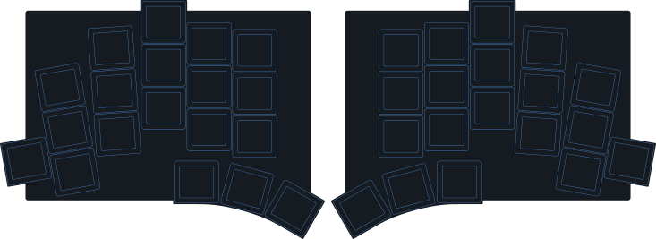

<picture>
  <source media="(prefers-color-scheme: dark)" srcset="docs/images/TOTEM_logo_dark.svg">
  <source media="(prefers-color-scheme: light)" srcset="docs/images/TOTEM_logo_bright.svg">
  
</picture>

# ZMK CONFIG FOR THE TOTEM SPLIT KEYBOARD

[Here](https://github.com/GEIGEIGEIST/totem) you can find the hardware files and build guide.\
[Here](https://github.com/GEIGEIGEIST/qmk-config-totem) you can find the QMK config for the TOTEM.

TOTEM is a 38-key column-staggered split keyboard. This configuration uses
[ZMK](https://zmk.dev/) and a SEEED XIAO BLE in each half.





## HOW TO USE

The layout is shared with 3w6 in this repository. Edit
[`../layout/layers.py`](../layout/layers.py) and
[`../layout/names.py`](../layout/names.py), then run `python generate.py all` from
the repository root. `config/totem.keymap` is generated; direct edits will be
overwritten. See the [main guide](../README.md) for layers and layout checks.

Push the complete `keyboards` repository, then open **Actions → Build ZMK
firmware**. The [root workflow](../.github/workflows/build-zmk.yml) uses the same
local build script below, with this folder's `build.yaml` and `config/` in an
isolated workspace. This supports the nested configuration directory.

Download the **totem-firmware** artifact from a successful run and unzip it.

1. Connect the left half by USB and press reset twice to enter the bootloader.
2. Copy `totem_left-xiao_ble-zmk.uf2` onto the keyboard's mass-storage drive.
3. Repeat for the right half using `totem_right-xiao_ble-zmk.uf2`.

## LOCAL BUILD

From the repository root:

```sh
bash totem/scripts/build-local.sh
```

The script regenerates the Totem keymap, reads `totem/build.yaml`, builds both
halves with Docker or Podman, and writes their firmware to `totem/firmware/`.
It caches downloaded west modules in `totem/.build/`. Python 3 and a working
container engine are required. See the script for path and image overrides.
